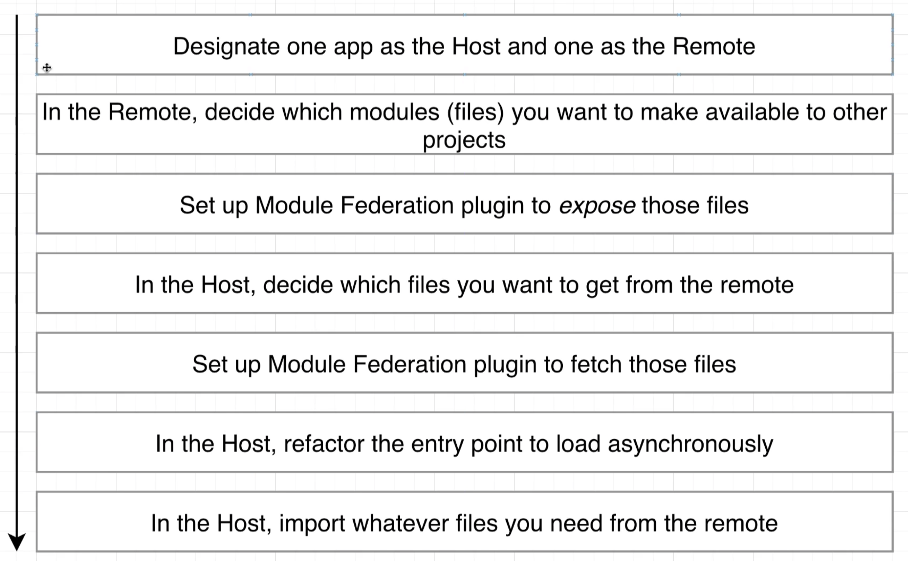
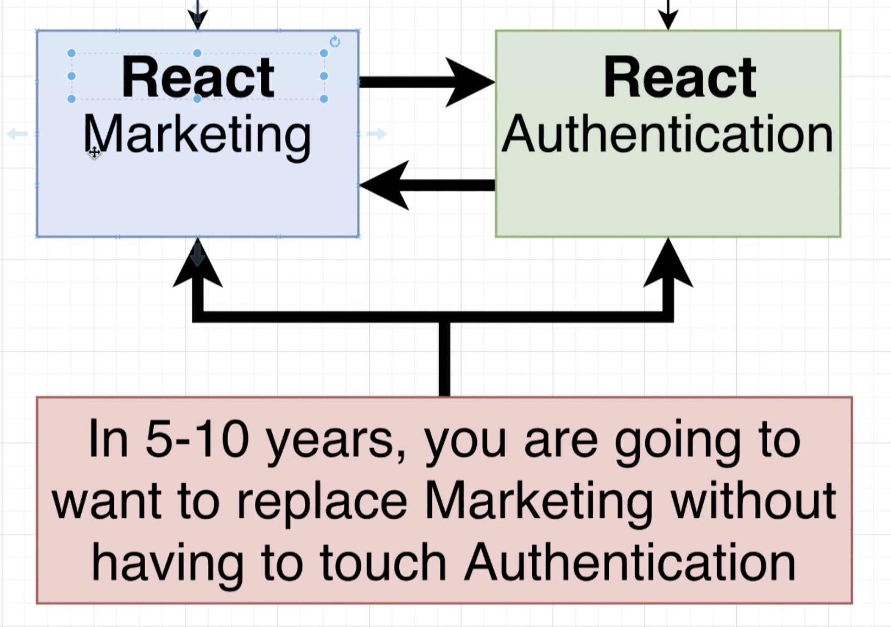
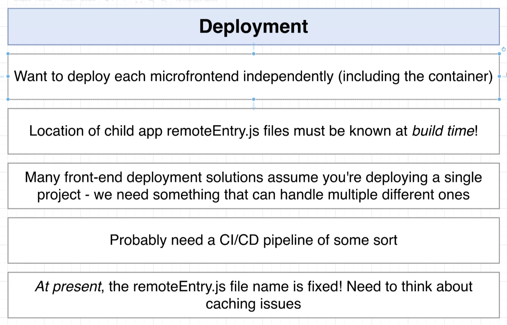

There are 3 different MFE exampes in here. This is for personal development.

Using single-spa to put together a "relatively" complex microfront end for example purposes

## Basic Requirements
### #1 - Zero coupling between child projects
* No importing of functions/objects/classes
* No shared state
* Share libraries through MF okay

### #2 - Near zero coupling between container & child apps
* Container shouldn't assume that a child is using a particular framework
* Any necessary communication done w/callbacks or simple events

### #3 - CSS from one poject shouldn't affect the other
* All CSS is scoped to app

### #4 - Version control shouldn't have any impact on overall project
* It cannot matter if we use monorepo or multi-repo

### #5 - Container should be able to decide to always use the latest version of an MFE OR specificy version
* Container will always use the latest version of a child app 
* Container can specify exactly what version of a child it wants to use

### #6 - Must be able to develop locally
* All code is double deployed
* Can work on ONLY your app and everything else is remote

**NEITHER OF THESE REQUIRE A REDEPLOY**

### #6 Deployment requirements
* Want to deploy each microfrontend independantly (including container)
* Location of child app must be known at build time
* Can handle deploying muliple projects
* CI/CD
* Apps are not containerized (Can be at edge)

## Routing Tier requirements
### Both container + sub-apps require routing features
* Users can navigate around to different sub apps using routing logic built into the container
* Users can navicate around _IN_ a subapp using routing logic built into the subapp itself
* Not all subapps will require routing

### Sub apps need to add in new pages routes all the time
* New routes added to a subapp shouldn't require a redeploy of the container

### We might need to show two or more MFEs at the same time
* This will occur all the time if we have some kind of sidebar nav that is built a a separate microfrontend

### We want to use off-the-shelf routing solutions
* Building a routing library can be hard, let's not do that shit
* Somt aount of custom code will be required, we're okay with that

### We need navication features for subapps in both hosted & isolation mode
* Developing for each environment should be easy
    * A dev should be immediatly be able to see what path they are visiting

### If different apps need to communicate info about routing it shoudl be done in as generic fasion as possible
* Each app might be using a completely different navigation framework
* We might swap out or upgrade naviation lirbaries all the time, shouldn't require a rewrite of the rest of the app

